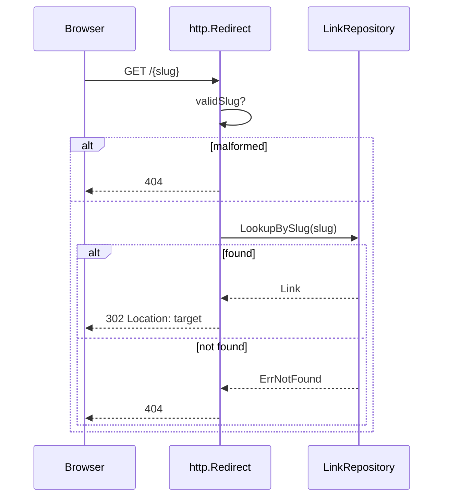

# Example story

A small worked story so the density is concrete. The hypothetical project is
`shrt`, a URL shortener with per-user namespaces; the design doc defines a
`LinkRepository` port, a Postgres adapter behind it, and a public redirect
surface. This is story 02-04 of phase 2 (short-link CRUD). A story with real
complexity (a DAG executor, an OAuth device flow) runs two to three times this
length; the shape stays the same.

````markdown
# 02-04: Public redirect endpoint

**Status:** ready-for-agent
**Phase:** 2, short-link CRUD
**Blocked by:** 02-01 Link domain and Postgres repo
**Serves:** R4, R9; design: Ports, Trust boundaries

## What to build

Paste a short link in a browser and land on the original URL. `GET /{slug}`
resolves a slug to its target and answers 302. It is the only unauthenticated
route in the API. Kept deliberately dumb: no click tracking, no rate limiting,
no custom error pages; phase 4 hardens it.

## Design

### Interfaces and types

The story consumes the port from 02-01; it adds no new port.

```go
type LinkRepository interface {
    LookupBySlug(ctx context.Context, slug string) (Link, error) // ports.ErrNotFound when absent
}
```

### Algorithm

1. Read `slug` from the path.
2. If it fails `^[a-zA-Z0-9]{1,16}$`, answer 404. Do not distinguish malformed
   from missing (R9: never leak whether a slug could exist).
3. `LookupBySlug`. `ErrNotFound` answers 404; any other error answers 500 with
   no detail in the body.
4. Answer 302 with `Location: <target>`. 302, not 301: browsers cache 301
   aggressively and the design reserves the right to retarget a slug.

### Diagram



### Sample code

```go
func (h *Handler) Redirect(w http.ResponseWriter, r *http.Request) {
    slug := chi.URLParam(r, "slug")
    if !validSlug(slug) {
        http.Error(w, notFoundHTML, http.StatusNotFound)
        return
    }
    link, err := h.repo.LookupBySlug(r.Context(), slug)
    switch {
    case errors.Is(err, ports.ErrNotFound):
        http.Error(w, notFoundHTML, http.StatusNotFound)
    case err != nil:
        http.Error(w, "internal error", http.StatusInternalServerError)
    default:
        http.Redirect(w, r, link.TargetURL, http.StatusFound)
    }
}
```

### Files

- `internal/adapters/primary/http/redirect.go` (new)
- `internal/adapters/primary/http/router.go` (mount `/{slug}` on the root
  router after the `/v1` subrouter, outside the auth middleware)

## TDD plan

1. **Redirect_KnownSlug_302WithLocation** at the HTTP seam with a fake
   repository: insert a link, GET the slug, expect 302 and the right Location.
2. **Redirect_UnknownSlug_404** : GET `/notreal`, expect 404 with the HTML body.
3. **Redirect_MalformedSlug_404** : GET `/has spaces`, expect 404, not 400.
4. **Redirect_NoAuthRequired** : no Authorization header, request still
   succeeds.
5. **AuthenticatedRoutes_StillRequireAuth** : `/v1/links` without auth still
   fails, proving the exemption did not bleed.

## Acceptance criteria

- [ ] All five tests pass (R4)
- [ ] Unknown and malformed slugs are indistinguishable from the outside (R9)
- [ ] `/v1/*` routes are unaffected
- [ ] `go test -race ./...` is green

## Out of scope

Click analytics and link expiry (post-MVP). Rate limiting on this endpoint
(phase 4, story 04-02).

## Verification

```bash
go test ./internal/adapters/primary/http/... -race -count=1

shrt login
SLUG=$(shrt create https://example.com -o slug)
curl -sI http://localhost:8080/$SLUG | head -2
# expect: HTTP/1.1 302 Found
#         Location: https://example.com
```
````

What the example shows: the design section carries only what this slice
touches (one port, one algorithm, one diagram, one sketch), the sample code is
a shape rather than a finished file, every acceptance criterion names the
requirement it proves, and the verification ends with a smoke a human can see.
